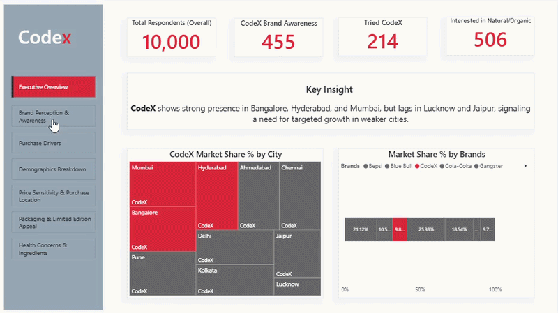
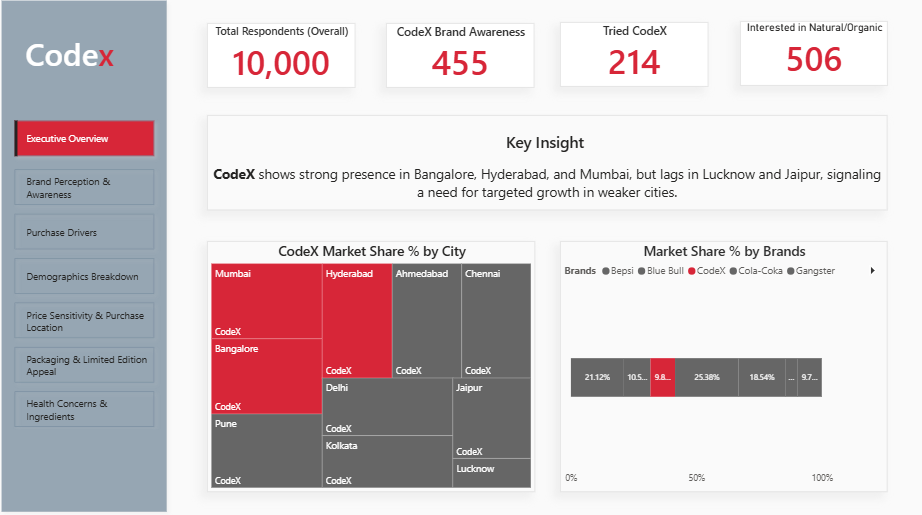
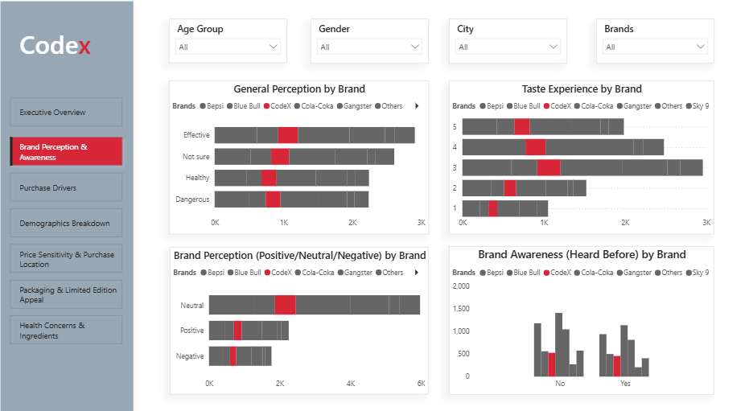
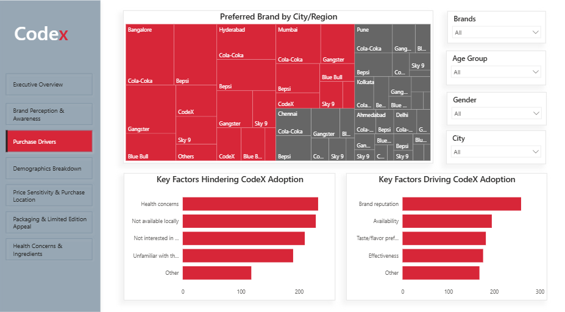
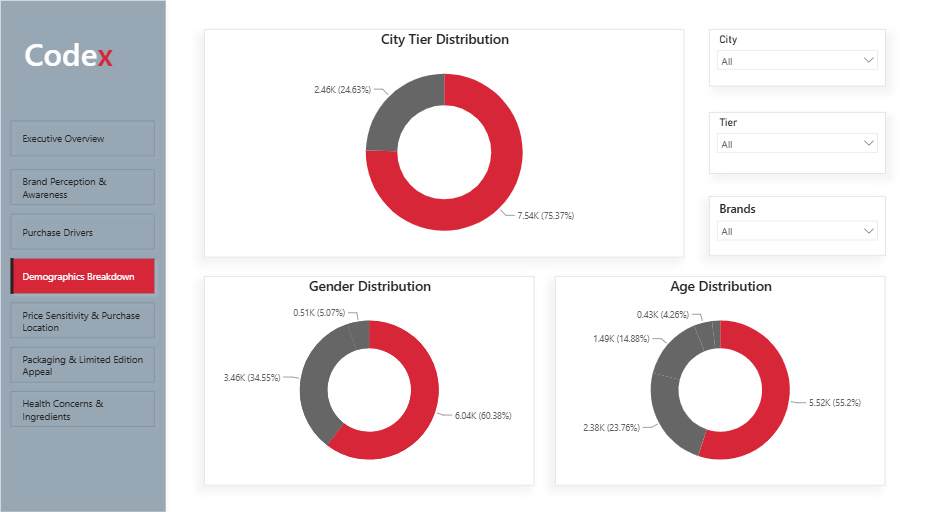
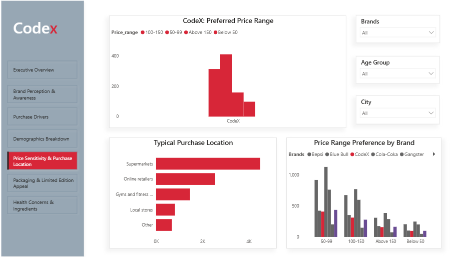
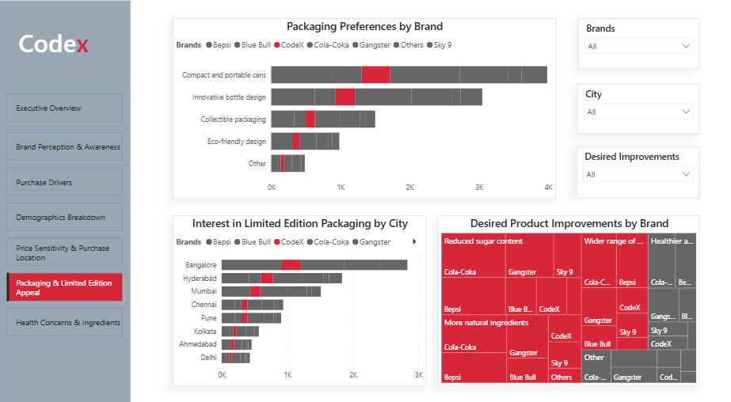
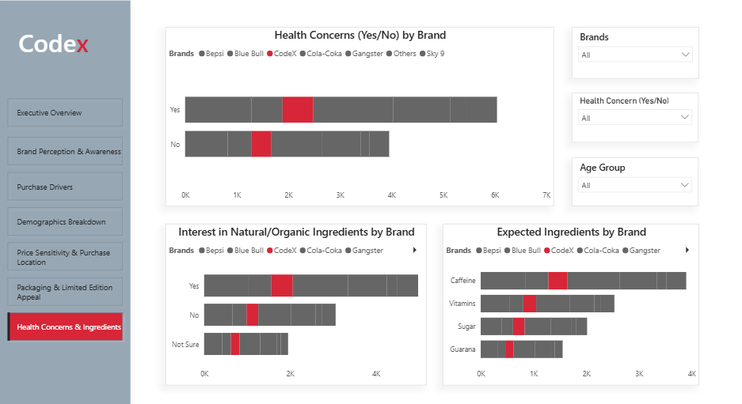

# CodeX — India Market Entry: Consumer Survey Analysis & CMO Presentation

_Power BI dashboard and executive presentation analyzing CodeX's market position in India's energy drink category, built as an independent data analysis project._

## Business Problem

CodeX is preparing to enter the Indian energy drink market. Before committing marketing and distribution investment, the business needed to understand: how aware are consumers of CodeX today, how does it stack up against established competitors, what's actually stopping people from trying it, and where should limited resources go first? This project turns a 10,000-respondent consumer survey into a decision-ready market position analysis for a CMO audience.

## My Role

This was my first independent end-to-end data analysis project. I built the full Power BI dashboard (data modeling, DAX measures, 7-page report), identified and resolved a significant data quality issue in the raw survey responses, and developed the accompanying CMO presentation, including the market positioning narrative and the five strategic recommendations.

## Approach

- **Data cleaning:** Identified a logical inconsistency where 28.55% of respondents reported trying CodeX without ever having heard of it. Rather than discard nearly a third of the dataset, I flagged these responses with a DAX calculated column and excluded them only from the specific measures they contradicted (awareness, trial), preserving their answers to unrelated questions.
- **Modeling:** Built relationships across the respondent, city, and survey-response tables; corrected a scope error where several dashboard metrics were unintentionally calculated against current CodeX users (n=980) instead of the full survey population (n=10,000).
- **Analysis:** Compared CodeX against six competitor brands across awareness, brand perception, purchase drivers, and demographics, with a dedicated view of the underlying city-level breakdown.
- **Synthesis:** Translated the dashboard's findings into a 19-slide executive presentation structured for a 15-minute CMO readout.

## Key Findings

**CodeX is a genuine underdog on awareness, but a closer one than it first appears.** CodeX holds 5.25% brand awareness, 6th of 7 tracked brands, behind Cola-Coka (14.04%), Bepsi (11.76%), and Gangster (10.43%). But it sits within half a percentage point of Sky 9 (5.74%) and Blue Bull (5.59%), meaning the nearer-term competitive target isn't the category leader, it's overtaking the two brands CodeX is already running neck-and-neck with.

**Trial is blocked by health concerns more than anything else, and it's concentrated exactly where CodeX is already strongest.** The top barriers to trial are health concerns, limited local availability, and low category interest. Health concerns are most pronounced in Bangalore, Hyderabad, and Mumbai, CodeX's own highest-awareness cities. Pushing more awareness spend into these markets without addressing the underlying health hesitation would likely under-deliver.

**Where CodeX does convert, it holds up reasonably well.** Among respondents who've tried CodeX, taste ratings cluster in the 3–4 range (out of 5), and 37% of aware consumers engage with the brand 2–3 times a week. The gap isn't in product experience, it's in getting people to trial in the first place.

## Recommendation

1. **Increase brand visibility** through targeted ads, social media campaigns, and campus outreach
2. **Expand distribution** via partnerships with gyms, e-commerce platforms, and kirana stores
3. **Introduce affordable, sugar-free product variants** to address the health-concern barrier directly
4. **Build a distinct brand narrative** around performance and health-forward formulation, an open positioning space, since no brand in this market has strongly claimed it yet
5. **Prioritize Bangalore, Hyderabad, and Mumbai** for combined awareness-and-health-messaging campaigns, since these cities show both CodeX's highest existing awareness and its most concentrated health-concern barrier

## Dashboard

7-page Power BI report covering brand awareness, perception, purchase drivers, demographics, pricing, packaging, and health/ingredient preferences, benchmarked against six competitor brands.

[Download the interactive .pbix dashboard]([paste-the-link-here](https://github.com/Dasha69-ops/codex-india-market-entry/compare/v1.0.0...main))

| Executive Overview                                           | Brand Perception & Awareness                                                   |
| ------------------------------------------------------------ | ------------------------------------------------------------------------------ |
|  |  |

| Purchase Drivers                                         | Demographics Breakdown                                               |
| -------------------------------------------------------- | -------------------------------------------------------------------- |
|  |  |

| Price Sensitivity & Purchase Location                                        | Packaging & Limited Edition Appeal                                           |
| ---------------------------------------------------------------------------- | ---------------------------------------------------------------------------- |
|  |  |

| Health Concerns & Ingredients                                                    |
| -------------------------------------------------------------------------------- |
|  |

## Tools Used

- **Power BI** — data modeling, DAX, dashboard build
- **PowerPoint / Canva** — executive presentation

## Data Sources

This project uses the dataset and case-study brief from codebasics' "Provide Insights to the Marketing Team in Food & Beverage Industry" exercise, **it is a structured learning case study, not primary research I personally collected.** The survey dataset (10,000 responses across three linked tables: respondents, cities, and survey responses) was provided as part of the exercise. Brand names in the dataset (Bepsi, Cola-Coka, Blue Bull, Gangster, Sky 9) are fictional stand-ins for real energy drink brands, used for case-study purposes.

The data cleaning, modeling, analytical findings, data quality correction, and presentation narrative in this repository are my own independent work built on top of the provided dataset.

## Acknowledgments

Built as an independent project using the codebasics "Food & Beverage Industry" case study dataset. This is my first full, independently completed data analysis project, including the identification and correction of a real data quality issue in the source survey data.
